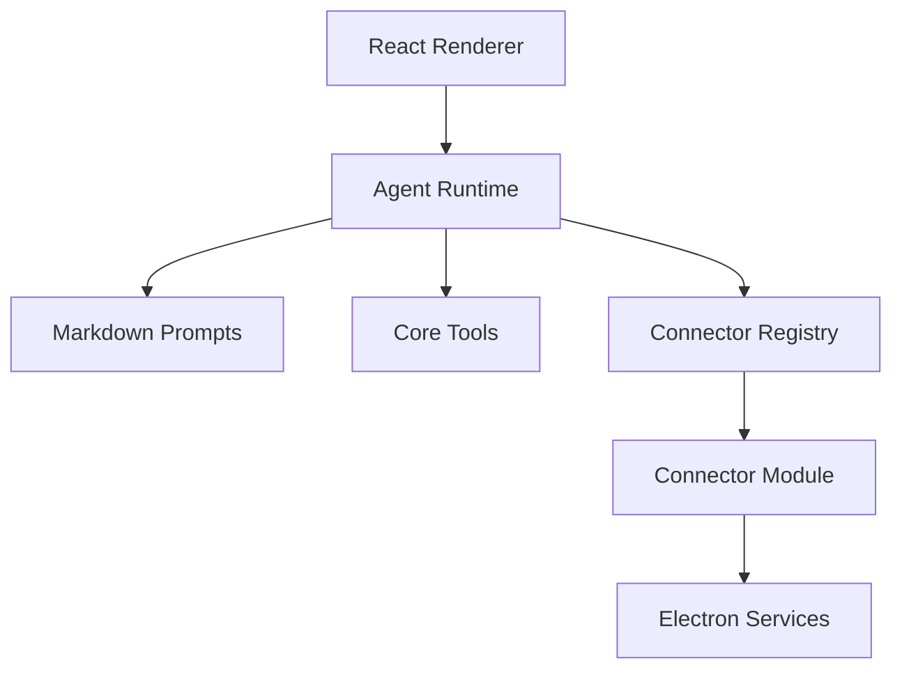

# Architecture

smile:D is a desktop framework for building vertical AI agents. The core should stay connector-neutral; domain behavior belongs in connectors.

## Layers

## Responsibilities

- `src/agent` owns the conversation loop, tool execution flow, pending action lifecycle, scratchpad, streaming, and result handling.
- `src/prompts` owns core Markdown prompts and prompt assembly.
- `src/connectors` owns connector contracts and connector modules.
- `src/components` owns generic UI. Connector-specific UI should move into connector folders or be contributed through connector registries.
- `electron` owns desktop services and IPC boundaries. Connector modules call into optional **transport services** under `electron/services/` when OAuth, MCP, or secure API access is required. See [electron/services/README.md](../electron/services/README.md).

## Connector module vs transport service

| Location | Purpose |
| --- | --- |
| `src/connectors/<id>/` | Agent tools, prompts, formatters, thin `runtime.ts` (required for every connector) |
| `electron/services/<name>.ts` | Main-process auth and API/MCP transport (optional; e.g. `atlassian-mcp.ts` for Jira) |

The agent never imports desktop services directly. Only `runtime.ts` (via preload IPC) talks to them.

## Data Flow

1. The user sends a chat message in the renderer.
2. `ChatView` creates or reuses an `Agent`.
3. The agent assembles the system prompt from core Markdown, memory, and connector prompt sections.
4. The model calls core tools or connector tools.
5. Core tools execute through generic handlers; connector tools execute through connector runtimes.
6. Write tools create pending actions and wait for user approval.
7. Tool results are compressed before being returned to the model.
8. **Task continuity** (`taskContinuity.ts`) keeps read→write workflows from stopping early. Detail: [taskContinuity.md](../src/agent/taskContinuity.md).

## Agent loop guards (core)

All guards are documented in [src/agent/HELPERS.md § Loop guards](../src/agent/HELPERS.md#loop-guards).

| Guard | Module | One-line |
| --- | --- | --- |
| Action-first | `actionGuards.ts` | Plan in chat instead of tools |
| Task continuity | `taskContinuity.ts` | Read without write on edit tasks |
| Tool errors | `toolErrors.ts` + `shared/aiErrors.ts` | Failed tools and provider overload |
| Think-only | `index.ts` | Thinking block with no follow-up |

## Core Rule

If a behavior mentions a specific external product, it does not belong in `src/agent` or `src/prompts/core`.
