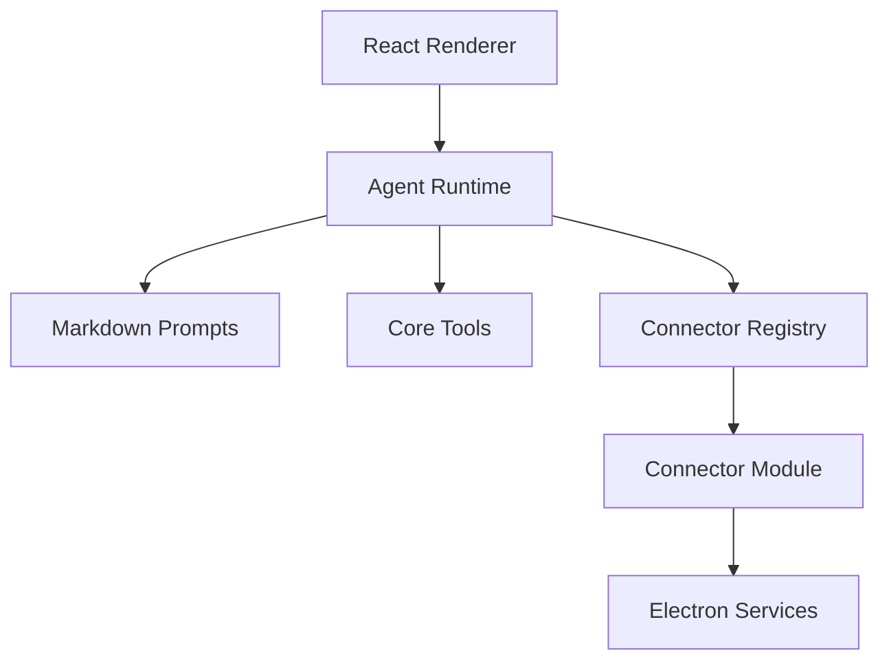

# Architecture

smile:D is a desktop framework for building vertical AI agents. The core should stay connector-neutral; domain behavior belongs in connectors.

## Layers

## Responsibilities

- `src/agent` owns the conversation loop, tool execution flow, pending action lifecycle, scratchpad, streaming, and result handling.
- `src/prompts` owns core Markdown prompts and prompt assembly.
- `src/connectors` owns connector contracts and connector modules.
- `src/components` owns generic UI. Connector-specific UI should move into connector folders or be contributed through connector registries.
- `electron` owns desktop services and IPC boundaries.

## Data Flow

1. The user sends a chat message in the renderer.
2. `ChatView` creates or reuses an `Agent`.
3. The agent assembles the system prompt from core Markdown, memory, and connector prompt sections.
4. The model calls core tools or connector tools.
5. Core tools execute through generic handlers; connector tools execute through connector runtimes.
6. Write tools create pending actions and wait for user approval.
7. Tool results are compressed before being returned to the model.

## Core Rule

If a behavior mentions a specific external product, it does not belong in `src/agent` or `src/prompts/core`.
