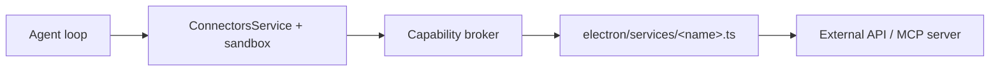

# Electron Desktop Services

Desktop services live in the **Electron main process**. They exist because some work cannot (or should not) run in the renderer: OAuth callbacks, long-lived MCP proxy processes, secret storage, CORS-free HTTP, filesystem access, and provider SDKs that assume Node.js.

**Connectors do not live here.** Connector packages live under `<workspace>/.smile/connectors/<id>/` and run in a sandbox (`handler.js`). A desktop service is **optional transport infrastructure** brokered through `host.mcp.call`, `host.http.request`, or `host.call` when the integration needs main-process capabilities.

## Two layers (do not confuse them)

```text
<workspace>/.smile/connectors/<id>/   ← Author package (always create this)
  manifest.json                       ← Tools, permissions, auth fields
  handler.js                          ← Sandboxed executeTool / approveAction
  prompt.md                           ← Domain instructions

electron/services/<name>.ts           ← Optional transport (create only if needed)
  auth, HTTP/MCP, normalization, errors
```



| Layer | Owns | Example in this repo |
| --- | --- | --- |
| Connector package | What the agent knows, tool schemas, prompt, handler logic | `.smile/connectors/my-api/` |
| Desktop service | How the desktop app reaches a provider securely | `electron/services/atlassian-mcp.ts` (MCP server id `atlassian`) |

See also: [Creating a connector](../../docs/creating-a-connector.md), [Architecture](../../docs/architecture.md).

---

## When do you need a new file in `electron/services/`?

Create a dedicated service when **any** of these apply:

| Need | Why main process |
| --- | --- |
| **OAuth / browser login** | Local callback port, token exchange, secure persistence |
| **Hosted or local MCP** | Spawn/manage proxy process, JSON-RPC over stdio/HTTP |
| **API keys that must not touch the renderer** | Read/write via `storage.setSecure` in main only |
| **CORS-blocked REST from the app** | HTTP from main process (same pattern as `ai.ts`) |
| **Long-lived connections** | Keep-alive, reconnect, background token refresh |
| **Provider SDK requires Node** | Official clients that don't run in Chromium |
| **Payload normalization** | Translate agent-friendly args into provider API shapes before send |
| **Structured error parsing** | Map provider/MCP errors into `{ success, error }` the sandbox expects |

You often **do not** need a new service when:

- The connector uses only sandbox-brokered HTTP with URLs declared in `permissions.http`.
- All logic fits in `handler.js` with existing host capabilities.

**Rule of thumb:** start with a manifest + `handler.js`. If the sandbox broker lacks a capability, extend the broker or add `electron/services/<vendor>-<transport>.ts` and register it (MCP servers go in `mcpServerRegistry` in `main.ts`).

---

## What a connector transport service should do

A file like `atlassian-mcp.ts` is **transport**, not a connector. It should:

### 1. Connection lifecycle

- Connect / disconnect / reconnect
- Expose connection state (connecting, oauth_pending, connected, error)
- Optional keep-alive for MCP or websocket transports
- Clear errors when auth expires or the user switches accounts

### 2. Authentication

- Run OAuth flows (open browser, listen on callback port, store tokens)
- Or load API keys from secure storage
- Never log tokens; never pass secrets to the renderer except “configured: yes/no”

### 3. Operation methods

- Methods the MCP registry or `host.call` broker needs — often raw `callRawTool(toolName, args)` for MCP
- Accept **agent-friendly** arguments where possible; normalize inside the service

### 4. Provider payload normalization

External APIs often expect nested objects. The model sends simple values. Normalize in the service **before** the provider call.

```typescript
// Handler might pass:  { priority: "Low" }
// Provider API expects: { priority: { name: "Low" } }
```

Keep normalization in the service or connector handler, not in `src/agent`.

### 5. Error handling

- Parse provider/MCP responses into a consistent shape:
  - `{ success: true, data }` on success
  - `{ success: false, error: "human-readable message" }` on failure
- Do **not** return `success: true` when the provider returned `isError: true` (common MCP pitfall)

### 6. No agent or prompt logic

- No tool schemas, no Markdown prompts, no approval UI copy
- No imports from `src/agent` or `src/prompts`

---

## Services in this repo

| File | Role |
| --- | --- |
| `atlassian-mcp.ts` | Atlassian Rovo MCP: OAuth via `mcp-remote`, proxy process, raw tool calls — registered as MCP server id `atlassian` |
| `connectors.ts` | Discovers workspace packages, forks sandbox, brokers `host.*` |
| `ai.ts` | LLM providers (streaming, tools, retries) | Core agent |
| `files.ts` | Workspace read/write/search | Core file tools |
| `memory.ts` | `.smile/memories` persistence | Core memory tools |
| `storage.ts` / `encryption.ts` | Settings and secure credentials | App-wide |
| `ocr.ts` | OCR provider calls | `file_read_ocr` |

Connectors that declare `"permissions": { "mcp": ["atlassian"] }` call tools through the sandbox broker → `mcpServerRegistry.atlassian`. The renderer only exposes MCP **connection** IPC (`mcp.connect` / `disconnect` / status) for the settings UI.

---

## Wiring checklist (new MCP server or host capability)

When you add transport for a new provider:

1. **Service class** — focused methods, no IPC inside the class
2. **`electron/main.ts`** — register in `mcpServerRegistry` and/or `hostCall` broker; thin `ipcMain.handle` for user-facing connect/disconnect if needed
3. **`electron/preload.ts`** — expose only what the renderer needs (prefer generic `connectors.*` + minimal `mcp.*`)
4. **`src/types/electron.d.ts`** + **`src/hooks/useElectron.ts`** — types and hooks for new IPC surface
5. **Connector manifest** — declare `permissions.mcp` / `permissions.host` / `permissions.http` to match

Keep `main.ts` thin: register handlers, compose services, forward events.

### Naming

Prefer descriptive transport names: `atlassian-mcp.ts`, `acme-api.ts`. Avoid generic names like `connector-service.ts` unless shared by multiple connectors.

---

## MCP vs REST patterns

### MCP pattern (like `atlassian-mcp.ts`)

Use when the vendor ships a hosted MCP server or you run a local MCP server.

The service typically:

1. Spawns or connects to an MCP proxy (e.g. `mcp-remote`)
2. Implements OAuth if required
3. Exposes `callRawTool(toolName, args)` for the connector broker
4. Parses MCP content blocks and `isError` flags

Declarative connector tools map 1:1 in the manifest:

```json
"mcp": { "serverId": "atlassian", "toolName": "searchItems" }
```

### REST pattern

Use when you call HTTP APIs directly. Prefer `host.http.request` from `handler.js` when URLs fit `permissions.http`. Add a dedicated service when OAuth, uploads, or SDK clients require main process.

---

## Quick decision tree

```text
Adding a connector?
│
├─ REST + API key, URLs in permissions.http
│    └─ manifest + handler.js only (host.http broker)
│
├─ Vendor MCP + OAuth
│    └─ manifest + handler.js + electron/services/<vendor>-mcp.ts
│       + entry in mcpServerRegistry (see atlassian-mcp.ts)
│
└─ Custom host integration (binary upload, proprietary SDK)
     └─ manifest permissions.host + host.call broker in ConnectorsService
```

---

## Future direction

Move toward **fully generic connector IPC** so new connectors rarely require hand-editing `preload.ts` and `useElectron.ts`. Workspace packages and the sandbox broker are the default path today.
